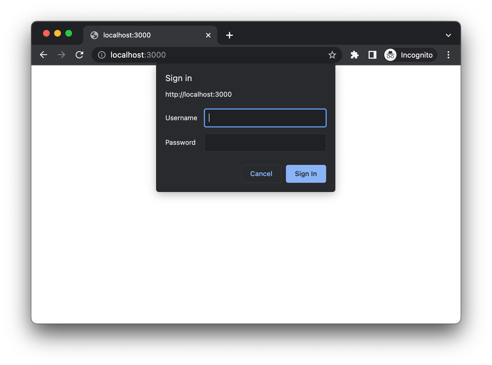

# HTTP Basic Authentication

> **Step 1:**  
When the browser first requests the server, the server tries to check the availability of the Authorization header in the request. Because it is the first request, no Authorization header is found in the request. So the server responds with the 401 Unauthorized response code and also sends the WWW-Authenticate header with the value set to Basic, which tells the browser that it needs to trigger the basic authentication flow.
   
`401 Unauthorized`   
`www-Authenticate: Basic realm='user_pages'`
   
If you notice the response, we have an additional parameter called realm, which is just a value assigned to a group of pages that share the same credentials.  
The browser might use Realm to cache the credential. In the future, when there is an authentication failure browser will check if it has the credentials in the cache for the given realm of the domain, and it may use the same credentials.

> **Step 2:**  
Upon receiving the response from the server, the browser will notice the WWW-Authenticate header and will show the authentication popup. 

> **Step 3:**  
After the user submits the credentials through this authentication popup, the browser will automatically encode the credentials using the base64 encoding and send them in the Authorization header of the same request.

> **Step 4:**  
Upon receiving the request, the server will decode and verify the credentials. If the credentials are valid, the server will send the response to the client. 
So that is how Basic Authentication works.

 
Reference: https://roadmap.sh/guides/http-basic-authentication

   

# Example In Laravel Lumen
- Make a `BasicAuthMiddleware.php` in `app/Http/Middlewares`
- In BasicAuthMiddleware, get <i>Authorization header</i> in client request, use base64_decode to get `[username, password]`. Then, check `username` and `password` valid and pass middleware.  
If cridentials is not valid, return response with `status code 401` and a header `www-authenticate` with value `Basic realm="user_pages"`.
- Register middleware in `bootstrap/app.php`